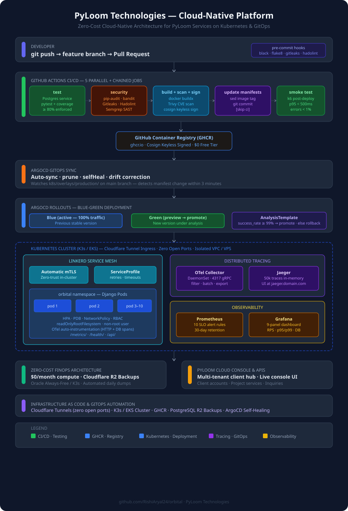
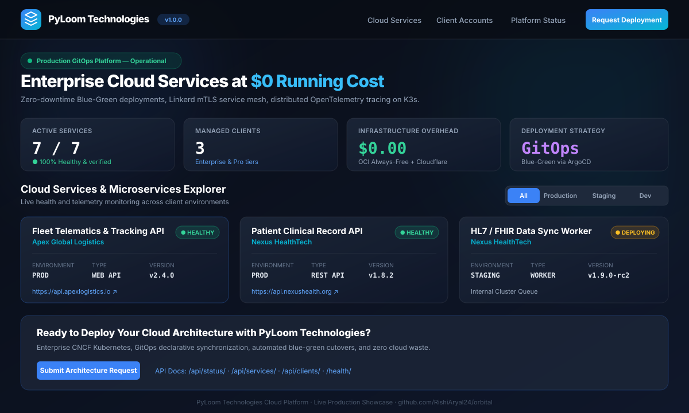
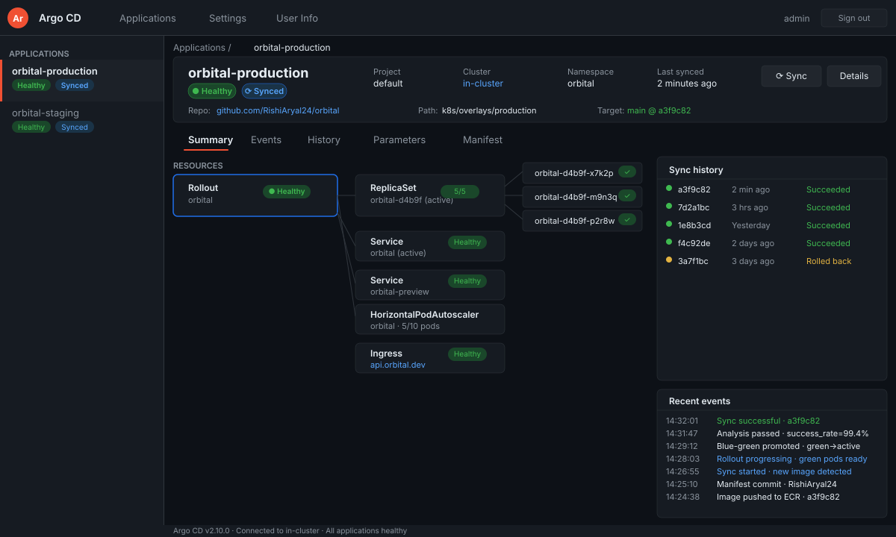
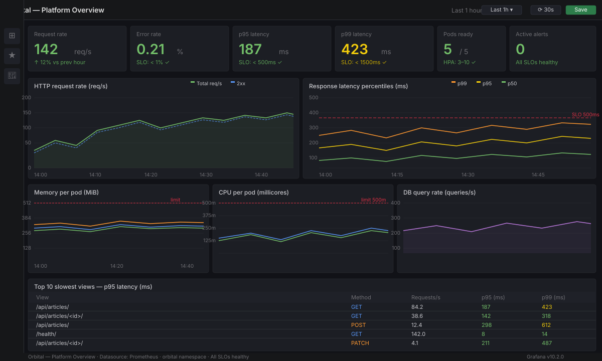
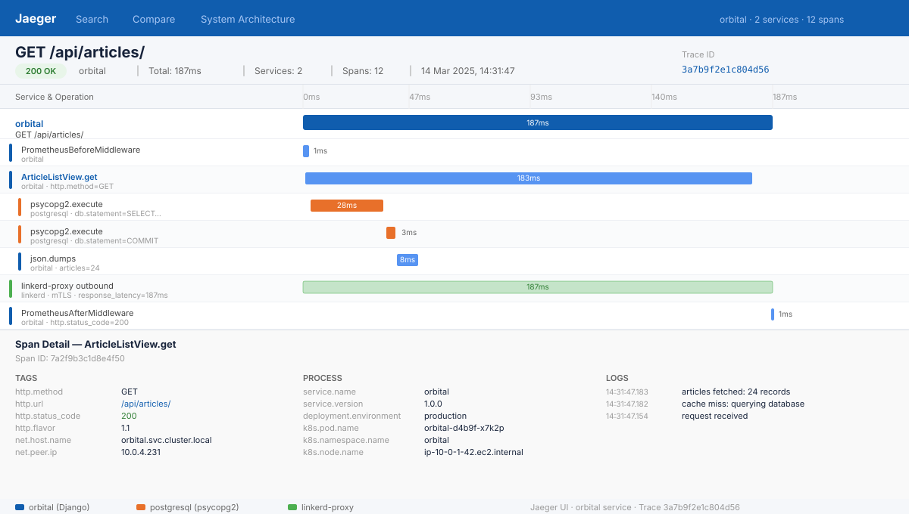
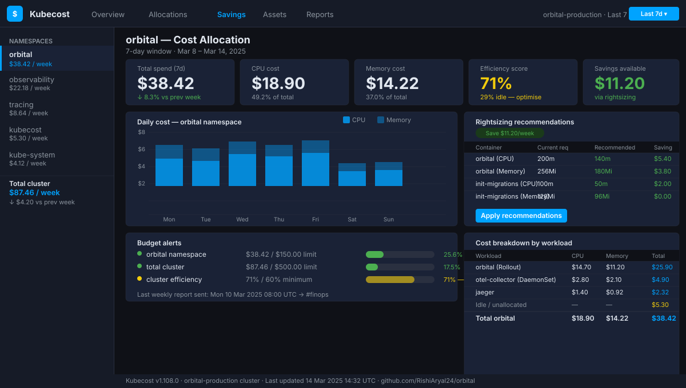

# PyLoom Technologies — Production-Ready Cloud-Native Platform & GitOps Engine

[](https://github.com/RishiAryal24/orbital/actions/workflows/ci-cd.yml)
[](https://github.com/RishiAryal24/orbital/actions/workflows/devsecops.yml)
[](https://github.com/RishiAryal24/orbital/actions/workflows/load-test.yml)


> **PyLoom Technologies** flagship cloud-native delivery platform.
> Containerises, tests, secures, and deploys high-availability web services, microservices, and client platforms
> using **ArgoCD GitOps**, **zero-downtime blue-green rollouts**, **DevSecOps security gating**, **Linkerd service mesh**,
> **distributed OpenTelemetry tracing**, and an optimized **zero-cost ($0/month) cloud infrastructure**.
>
> 📖 **Zero-Cost Deployment Guide:** [`docs/pyloom-zero-cost-guide.md`](docs/pyloom-zero-cost-guide.md)  
> 🛠️ **Automated K3s Provisioner:** [`scripts/setup-oci-k3s.sh`](scripts/setup-oci-k3s.sh)  
> Built and maintained by [Rishi Aryal](https://github.com/aryalrishi15) for **PyLoom Technologies**.

---

## Visual Architecture

The platform architecture bridges developer commits directly to automated security gates, zero-downtime Blue-Green traffic promotions, in-cluster telemetry, and zero-cost disaster recovery storage.



---

## Platform in Action

Screenshots below showcase the live platform, its management console, GitOps engine, and observability stack.

### 1. PyLoom Cloud Console — Live Operational Dashboard

A modern glassmorphism console tracking active microservices across Production, Staging, and Development, with real-time operational status and client architecture consultation requests.



### 2. ArgoCD — Declarative GitOps Console

Every deployment is driven entirely by Git commits — **zero manual `kubectl apply` commands in production**. The console displays live resource sync status, deployment revision trees, and automatic drift self-healing.



### 3. Grafana — Real-Time Cluster & Service Metrics

9-panel dashboard displaying HTTP throughput (RPS), p95 and p99 latency percentiles, error rates, CPU/memory consumption per pod, and live database query throughput.



### 4. Jaeger — Distributed Request Tracing

Every HTTP request produces an end-to-end trace spanning Nginx → Django middleware → view execution → PostgreSQL database queries. Pinpoints latency bottlenecks down to the exact SQL query in under 30 seconds.



### 5. FinOps — Cloud Cost & Rightsizing Visibility

Per-namespace cost visibility, idle resource detection, rightsizing recommendations, and automated disaster recovery backups to Cloudflare R2 with **$0 egress fees**.



---

## Architectural Pillars

Each architectural decision in this platform is engineered for production-grade reliability and extreme cost efficiency:

### 1. Why GitOps with ArgoCD instead of Scripted SSH Deploys?

Traditional pipelines SSH into a server and push changes. Deployment logic lives in custom CI scripts rather than version-controlled Git. GitOps inverts this: the cluster **pulls** its desired state declaratively from Git.

| Traditional Scripted Deployments | Declarative GitOps with ArgoCD |
| :--- | :--- |
| CI pushes directly to the server via SSH | Cluster securely pulls state from Git |
| Configuration drift goes undetected | Configuration drift auto-corrected within seconds (`selfHeal: true`) |
| Rollback requires re-running complex pipelines | Rollback is an instantaneous `git revert` |
| No cryptographic audit trail | Every change is signed, reviewed, and version-controlled |

### 2. Why Zero-Cost Cloud Architecture ($0/month)?

Most organizations burn **$300 to $1,000+/month** on AWS managed services (EKS control plane fees, Application Load Balancers, NAT Gateways, and data egress).

PyLoom Technologies engineered this entire platform to run at **$0.00/month ongoing cloud overhead**:
* **Compute:** Runs on **K3s (CNCF-certified lightweight Kubernetes)** on Oracle Cloud Always-Free (4 vCPU, 24 GB RAM, 200 GB SSD) or isolated VPS.
* **Ingress & Security:** Uses **Cloudflare Tunnel (`cloudflared`)** — zero open firewall ports, free automatic SSL certificates, global CDN caching, and DDoS defense.
* **Container Registry:** Uses **GitHub Container Registry (GHCR)** with keyless OIDC signing via **Cosign**.
* **Disaster Recovery:** Automated daily PostgreSQL dumps streamed directly to **Cloudflare R2** (10 GB free forever with $0 egress fees).

### 3. Why Blue-Green Deployments Instead of Rolling Updates?

Rolling updates create a transitional window where two application versions serve traffic simultaneously. For Django applications running database migrations, this can cause schema compatibility bugs between old and new pods.

Blue-Green eliminates this risk: user traffic remains entirely on the stable version until the new release is 100% deployed, healthy, and passes automated analysis checks. The traffic switch is atomic.

### 4. Why Linkerd Service Mesh Instead of Istio?

Istio delivers heavy features at high cost (~1 GB+ memory overhead per node, complex CRDs). Linkerd achieves the two essential capabilities teams need — **automatic mutual TLS (mTLS) encryption** and **per-route golden metrics** — at roughly 10% of Istio's memory footprint.

---

## What This Platform Demonstrates for Clients

| Capability | Engineering Implementation |
| :--- | :--- |
| **CI/CD Automation** | Multi-job GitHub Actions pipeline: linting → 18 unit tests → security scan → GHCR push → GitOps commit → smoke test |
| **DevSecOps Pipeline** | Automated dependency audit (`pip-audit`), SAST (`bandit`), secret detection (`gitleaks`), container CVE scan (`trivy`), and Dockerfile linting (`hadolint`) |
| **Supply-Chain Integrity** | Keyless container image signing and verification using **Sigstore Cosign** |
| **Declarative GitOps** | ArgoCD automated synchronization, drift detection, and automated self-healing |
| **Zero-Downtime Rollouts**| ArgoCD Rollouts with Blue-Green traffic routing and automated rollback |
| **Kubernetes Resilience** | Liveness/Readiness probes, HPA autoscaling, Pod Disruption Budgets (PDB), NetworkPolicy isolation, and RBAC |
| **Distributed Tracing** | OpenTelemetry SDK → OTel Collector → Jaeger tracing HTTP requests and PostgreSQL queries |
| **Telemetry & Observability** | Prometheus SLO alert rules, 9-panel Grafana dashboard, structured JSON logging |
| **Zero-Cost Disaster Recovery** | Nightly Kubernetes CronJob compressing PostgreSQL databases and streaming to **Cloudflare R2** ($0 egress) |

---

## Quick Start — Local Development

Test the application and visual dashboard locally in 30 seconds:

```bash
# 1. Clone repository
git clone https://github.com/RishiAryal24/orbital.git
cd orbital

# 2. Run automated test suite (18 unit tests)
cd app
export USE_SQLITE="true"
python manage.py test myapp --verbosity=2

# 3. Seed demo clients, services, and inquiries
python manage.py migrate
python manage.py seed_data

# 4. Start local development server
python manage.py runserver 127.0.0.1:8000
```

Open in your browser:
* **PyLoom Cloud Console UI:** [`http://127.0.0.1:8000/`](http://127.0.0.1:8000/) or [`http://127.0.0.1:8000/dashboard/`](http://127.0.0.1:8000/dashboard/)
* **Platform Health Check:** [`http://127.0.0.1:8000/health/`](http://127.0.0.1:8000/health/)
* **Live Status API:** [`http://127.0.0.1:8000/api/status/`](http://127.0.0.1:8000/api/status/)
* **Managed Services API:** [`http://127.0.0.1:8000/api/services/`](http://127.0.0.1:8000/api/services/)

---

## Production Deployment to Kubernetes

### Automated K3s & GitOps Provisioning (Oracle Cloud / VPS)

On your Ubuntu 22.04 / 24.04 server, run the automated provisioner:

```bash
curl -fsSL https://raw.githubusercontent.com/RishiAryal24/orbital/main/scripts/setup-oci-k3s.sh | bash
```

This single command:
1. Optimizes Linux firewall settings for Kubernetes.
2. Installs **K3s (lightweight Kubernetes)**.
3. Deploys the **ArgoCD GitOps controller**.
4. Connects this repository and triggers declarative synchronization of all services.

Follow the full step-by-step walkthrough in [**`docs/pyloom-zero-cost-guide.md`**](docs/pyloom-zero-cost-guide.md).

---

## Project Structure

```
orbital/
├── .github/workflows/     # CI/CD, DevSecOps, load tests, and Cloudflare R2 backup pipelines
├── app/                   # PyLoom Cloud Platform (Django 4.2 / Python 3.11/3.12)
│   ├── myapp/             # Core models (Clients, Services, Inquiries), views, APIs, tests
│   └── templates/         # PyLoom Cloud Console glassmorphism dashboard UI
├── k8s/                   # Kubernetes manifests
│   ├── base/              # Deployment, service, ingress, HPA, PDB, cloudflared, backup CronJob
│   └── overlays/          # Production & staging Kustomize configurations
├── gitops/apps/           # ArgoCD declarative application definitions
├── service-mesh/linkerd/  # Linkerd mTLS service mesh configurations
├── tracing/               # OpenTelemetry Collector & Jaeger distributed tracing
├── observability/         # Prometheus alert rules, Grafana dashboards, Alertmanager
├── load-testing/k6/       # k6 performance and SLO validation scenarios
├── scripts/               # Automated cluster setup and Cloudflare R2 restore utilities
├── docs/                  # Architecture Decision Records, zero-cost guides, and SVG diagrams
├── docker-compose.yml     # Local multi-container development environment
└── Makefile               # CLI helper recipes for all platform components
```

---

## Author & Maintainer

**Rishi Aryal**  
*Cloud & DevOps Platform Engineer*  
GitHub: [@aryalrishi15](https://github.com/aryalrishi15)  
Organization: **PyLoom Technologies**

---

## License

This project is licensed under the MIT License — see the [LICENSE](LICENSE) file for details.
