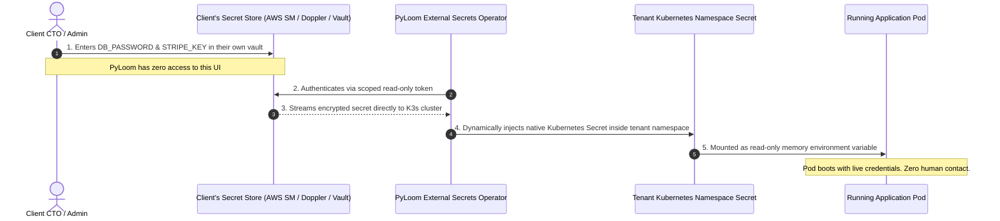

# PyLoom Technologies — Zero-Trust Multi-Tenant Secrets Architecture

```
================================================================================
Document Title  : Distributed Multi-Tenant Secrets Management Guide
Standard        : Zero-Knowledge Secret Handling Policy (SOC-2 / ISO 27001)
Platform        : PyLoom Cloud-Native Delivery Platform (Orbital)
Lead Architect  : Rishi Aryal (aryalrishi15@gmail.com)
Target Audience : Security Officers, Lead DevOps Engineers, Client Technical Leads
================================================================================
```

---

## 1. The Core Problem: Why PyLoom Never Handles Client Passwords

When providing managed cloud hosting or DevOps services, the biggest liability and security risk is handling client secrets:
* Database root passwords
* Payment gateway credentials (Stripe, PayPal, Adyen)
* Third-party API keys (SendGrid, Twilio, OpenAI)
* Private SSH and signing keys

**The Traditional (Dangerous) Way:**
The client emails credentials or posts them in Slack. A DevOps engineer pastes them into a `.env` file or Kubernetes secret.
- **Risk 1:** PyLoom becomes liable if the client's Stripe account is compromised.
- **Risk 2:** Client fails SOC-2 / HIPAA compliance audits because third parties possess unencrypted production credentials.

**The PyLoom Zero-Knowledge Architecture:**
PyLoom uses the **External Secrets Operator (ESO)** pattern. **PyLoom engineers never see, touch, or store client plaintext secrets.**

---

## 2. Architecture & Data Flow



---

## 3. Supported Client Secret Providers

The platform supports integration with any major enterprise secret store:

| Provider | Client Setup Effort | Security Rating | Best For |
| :--- | :--- | :--- | :--- |
| **Doppler (Recommended for Startups)** | 5 minutes (GUI based) | SOC-2 Type II | Seed/Series-A startups wanting instant setup without managing a vault |
| **AWS Secrets Manager / GCP Secret Manager** | 10 minutes (IAM Role) | ISO 27001 / FedRAMP | Companies already running their cloud accounts on AWS/GCP |
| **HashiCorp Vault** | 15 minutes (AppRole / OIDC) | High Enterprise | FinTech / Banks requiring strict hardware security modules (HSM) |
| **Bitnami Sealed Secrets** | 5 minutes (Public Key Git) | Asymmetric Encryption | Teams wanting all secrets committed directly to Git in encrypted form |

---

## 4. Step-by-Step Client Onboarding SOP (Zero-Knowledge)

### Step 1: Client Creates a Scoped Secret Store
The client enters their production credentials into their preferred secret provider under a dedicated project/path:
```
Path: pyloom/production/acmecorp/
Keys:
  - DB_PASSWORD = "super-secret-database-pass"
  - STRIPE_SECRET_KEY = "sk_live_123456789"
```

### Step 2: Client Generates a Read-Only Service Token
The client creates a service token restricted strictly to `pyloom/production/acmecorp/*` with `read-only` permissions and expiration.

### Step 3: Cluster Ingests Scoped Token into Isolated Namespace
Run the onboard command:
```bash
kubectl create secret generic vault-token \
  --namespace=tenant-acmecorp \
  --from-literal=token="<CLIENT_READ_ONLY_TOKEN>"
```

### Step 4: Verification
Verify that the External Secret successfully generated the native Kubernetes secret:
```bash
kubectl get externalsecrets -n tenant-acmecorp
# Output:
# NAME                     STORE                   STORE-TYPE           READY   STATUS
# client-runtime-secrets   pyloom-vault-backend   ClusterSecretStore   True    SecretSynced
```

---

## 5. Security & Audit Guarantee for Clients

When pitching to prospective clients or enterprise procurement teams, provide them with this written commitment:

> **PyLoom Zero-Knowledge Secret Handling Guarantee:**
> 1. PyLoom Technologies employees never possess, request, or log client production API keys or database passwords.
> 2. All runtime secrets are fetched over TLS 1.3 directly from your organization's designated vault into cluster memory.
> 3. Secrets are never persisted to Git repositories, build logs, or unencrypted disks.
> 4. Revocation is instantaneous: Revoking the read token in your own vault immediately invalidates the cluster's sync within 60 minutes.

---

*PyLoom Technologies Security Architecture — Documented by Rishi Aryal (aryalrishi15@gmail.com)*
