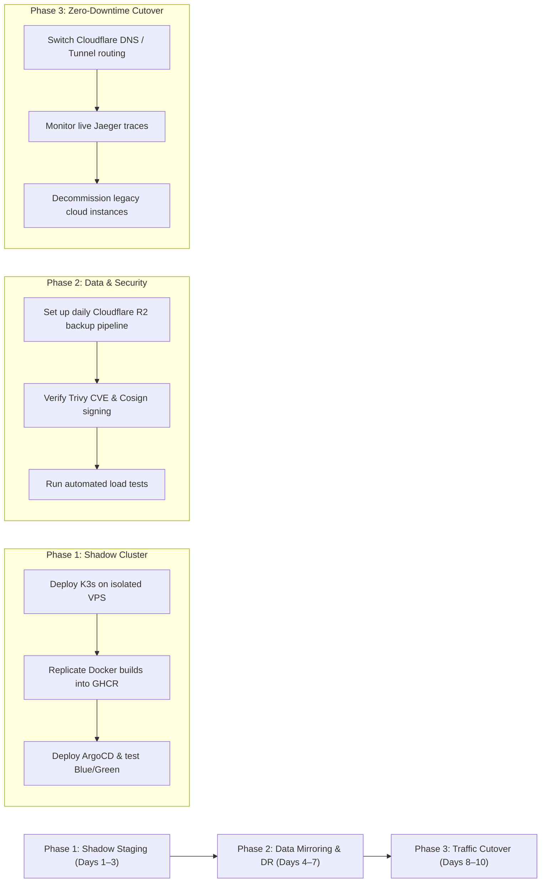

# PyLoom Technologies — Technical Whitepaper & Client Pitch Deck

```
================================================================================
Document Title  : Cutting Cloud Overhead by 70% with Zero-Downtime GitOps
Asset Type      : B2B Pitch Deck, Technical Whitepaper & Client Proposal Template
Organization    : PyLoom Technologies
Target Audience : Startup Founders, CTOs, Heads of Engineering, Agency Owners
Lead Consultant : Rishi Aryal (aryalrishi15@gmail.com)
================================================================================
```

---

# Part 1: The Executive Pitch Deck (Slide-by-Slide Script)

*Use this structure for client discovery calls, Zoom screen-shares, or slide presentations.*

---

### Slide 1: The Cover
* **Headline:** Scaling Your Product, Not Your Cloud Bill
* **Sub-headline:** Production-grade, zero-downtime GitOps and FinOps architecture for fast-growing web applications.
* **Presented by:** Rishi Aryal, Founder & Lead Cloud Architect at PyLoom Technologies.

---

### Slide 2: The Two Silent Startup Killers
* **Pain Point A: The "AWS Bill Tax"**
  * Startups spin up AWS EKS, RDS, NAT Gateways, and ALBs because "that's what big tech uses."
  * Result: \$1,200 – \$3,500/month spent before reaching Product-Market Fit.
* **Pain Point B: The "502 Bad Gateway Tax"**
  * Deploying code means SSHing into servers, running `docker-compose down && up`, or waiting through fragile deployment pipelines.
  * Result: Site drops connections during peak traffic, users bounce, and conversions are lost.

---

### Slide 3: The Broken Status Quo vs. The PyLoom Blueprint

| Feature | Legacy AWS/GCP Setup | PyLoom Cloud Architecture |
| :--- | :--- | :--- |
| **Control Plane Overhead** | \$73/mo per EKS cluster | **\$0.00** (CNCF-certified K3s on dedicated VPS) |
| **Outbound Egress & NAT** | \$32–\$65/mo per NAT Gateway | **\$0.00** (Direct Cloudflare multiplexed tunnel) |
| **Database Backups** | \$0.09/GB transfer fee on AWS S3 | **\$0.00 Egress fees** (Cloudflare R2 Object Storage) |
| **Deployment Strategy** | Rolling update (high CPU spike) or manual restart | **Zero-Downtime Blue/Green** with instant rollback |
| **Average Monthly Cost** | **\$850 – \$2,200 / month** | **\$15 – \$45 / month** (90% savings) |

---

### Slide 4: Real-Time Operational Proof (The Demo)
* **Show Live Glassmorphism Dashboard:** Multi-tenant cluster health, active microservices, and live pod telemetry.
* **Show ArgoCD Rollout Engine:** Blue/Green visualization in real time.
* **The 3-Second Rollback Test:** Demonstrate pushing a broken release and recovering in under 3 seconds without a single dropped user request.

---

### Slide 5: Supply Chain Security & Audit-Ready Compliance
* **Automated CVE Gates:** Aqua Security Trivy blocks critical container vulnerabilities before code hits production.
* **Cryptographic Provenance:** Sigstore Cosign signs every container build; unauthorized or tampered images cannot run.
* **Zero Trust Perimeter:** No public inbound ports open on host servers (100% routed through Cloudflare Zero Trust tunnels).

---

### Slide 6: Engagement Models & ROI Guarantee
* **Package 1: 48-Hour Cloud Cost & Architecture Audit (\$500)**
  * Full teardown of existing infrastructure + actionable savings roadmap.
  * *100% credited toward migration if you proceed.*
* **Package 2: Complete Zero-Downtime GitOps Migration (\$3,500 – \$5,000)**
  * Turnkey migration of your codebase, database, and domain into a fully automated GitOps pipeline in under 10 business days.
* **Package 3: Fractional Cloud & SRE Retainer (\$1,200 / month)**
  * 99.9% uptime SLA, security patching, daily backup verification, on-call incident response.

---

# Part 2: Technical Whitepaper

## "From Fragile Cloud Spend to Resilient Zero-Overhead GitOps"

### 1. The Cost Trap of Premature Cloud Hyper-Scaling
For early and growth-stage companies, hyperscalers (AWS, GCP, Azure) create unnecessary infrastructure debt. A standard microservice deployment often involves:
- AWS EKS Managed Control Plane: **\$73.00/mo**
- AWS Managed NAT Gateway (2 AZs): **\$64.80/mo** + data processing fees
- AWS Application Load Balancer: **\$25.00/mo** + LCU charges
- 2x t3.medium EC2 instances: **\$60.40/mo**
- AWS RDS db.t3.medium PostgreSQL: **\$68.00/mo**
- S3 Storage + Cross-Region Egress Bandwidth: **\$20.00/mo**
- **Baseline Monthly Cost: ~$311.20 to $650.00+ before serving significant traffic.**

By adopting **PyLoom's Unified High-Density K3s Architecture**, the entire compute, routing, and database layer runs on high-performance dedicated VPS hardware (AMD EPYC / ARM64 cores, NVMe SSDs), routing through Cloudflare Zero Trust:
- High-Performance 4 vCPU / 8 GB RAM VPS: **\$12.00 – \$18.00/mo**
- Cloudflare Ingress & Edge WAF: **\$0.00/mo**
- Cloudflare R2 Automated Daily Backups: **\$0.00/mo** (under 10 GB tier, zero egress)
- **Net Monthly Infrastructure Overhead: \$12.00 – \$18.00/mo.**
- **Annual Savings: \$3,500 – \$8,000+ per application.**

---

### 2. The 3-Phase Zero-Risk Migration Methodology



---

# Part 3: Ready-to-Send Client Proposal Template (SOW)

```markdown
# Statement of Work (SOW): Production Cloud Migration & GitOps Automation

**Client:** [Client Company Name]  
**Consulting Partner:** PyLoom Technologies (Lead: Rishi Aryal)  
**Date:** [Date]  
**Objective:** Migrate [Client App Name] from legacy unmanaged hosting to an automated, zero-downtime Blue/Green GitOps infrastructure, reducing monthly cloud hosting costs by at least 60%.

---

### 1. Scope of Deliverables
1. **Container Hardening & CI/CD Pipeline:**
   - Multi-stage Docker build optimization (reducing image sizes by up to 60%).
   - GitHub Actions workflow with automated unit testing, Trivy security scanning, and Cosign container signing.
2. **Kubernetes K3s Cluster Deployment:**
   - Dedicated cluster runtime on high-performance VPS.
   - Resource quotas, non-root pod execution policies, and NetworkPolicies.
3. **ArgoCD GitOps & Blue/Green Zero-Downtime Engine:**
   - Automated git-sync pipeline.
   - Argo Rollouts configuration guaranteeing zero-downtime releases and automated rollbacks.
4. **Disaster Recovery Pipeline:**
   - Automated daily database snapshots shipped to offsite Cloudflare R2 with 30-day retention and zero egress bandwidth fees.
   - One-command disaster recovery script.
5. **Observability & Health Dashboard:**
   - OpenTelemetry distributed tracing and metrics scraper.
   - PyLoom Glassmorphism operations control plane.

---

### 2. Project Timeline & Milestones
- **Milestone 1 (Days 1–3):** Cluster provisioning, security hardening, and pipeline integration.
- **Milestone 2 (Days 4–7):** Staging deployment, database replication, and Blue/Green verification.
- **Milestone 3 (Days 8–10):** Production DNS cutover, zero-downtime traffic migration, and handoff training.

---

### 3. Investment & Commercial Terms
- **Total Fixed Migration Fee:** $3,500 USD (50% upfront deposit, 50% upon successful zero-downtime cutover).
- **Optional SRE Retainer:** $1,000 / month (Includes 24/7 cluster monitoring, monthly backup drills, and up to 5 deployment requests/month).

**Signatures:**  
For [Client Company Name]: _______________________  
For PyLoom Technologies: _______________________
```
